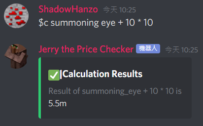
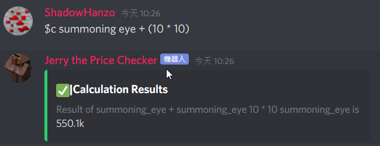
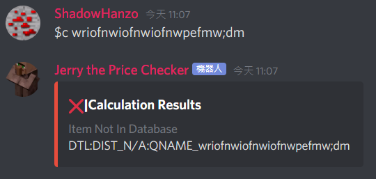

# $calculate

### Aliases

`$calc` , `$c` , `$C`

### Parameter

`<math>`is the parameter where you turn SkyBlock items into actual numbers\(items represent the number which is their price\)

### Description

This command allow you to calculate math while making SkyBlock items representing their price as a number, where `<math>` is the thing to calculate

### Notice

* Auto correction is supported here, but when it is off by 6 or more letters, the request fails
* This does not support multiplication and division prioritization, but if you bracket things up using brackets `()`, things will get prioritized

### Examples

