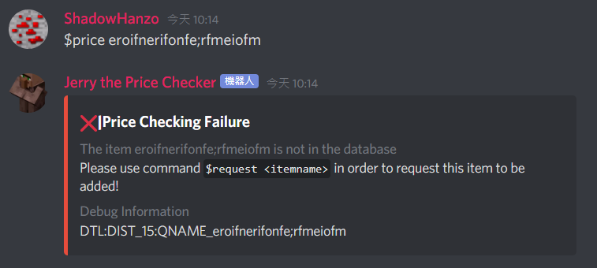

# $price

### Aliases

`$p` , `$P`

### Parameter

`<itemname>`is the parameter where you would place the SkyBlock item you want to check the price of

### Description

This command allow you to check the price of `<itemname>` and get a return

### Notice

* Auto correction is supported here, but when it is off by 6 or more letters, the request fails

### Examples

 

