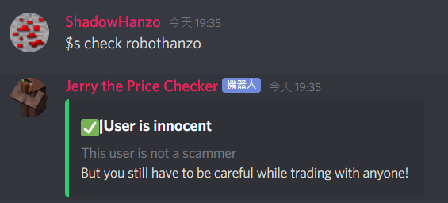
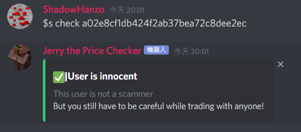
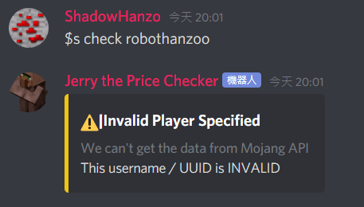

# $scammer check

### Aliases

`$s c` , `$s check`

### Parameter

`<ignOrUUID>`is the parameter where you would place the in game name or UUID of the player you want to check to be safe to trade with

### Description

Check if `<ignOrUUID>` is safe to trade with

### Examples

